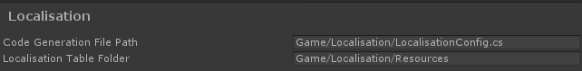

# Preferences

You can tweak the preferences by going to Edit -> Preferences on the tool bar and selecting the Localisation tab (on unity 2018.3 or newer it's nested under "Duck")

| Setting | Description |
|---------|-------------|
| Code Generation File Path | This determines where the generated localisation config c-sharp file is placed. This file is generated to contain all localisation keys as enums, for type safe access.
| Localisation Table Folder | This determines the default location where new localisation table assets are created. Each table contains all the translations for a specific locale.

There are 2 settings to tweak. You can configure where the generated config file goes and where the new localisation table assets will be created. You can leave the defaults if you and move the assets after they are created, but for convenience it's recommended to set the preferred paths in your project so you won't have to move them manually.

**Paths in preferences should not contain the "Assets" folder. It's added for you.**
 
